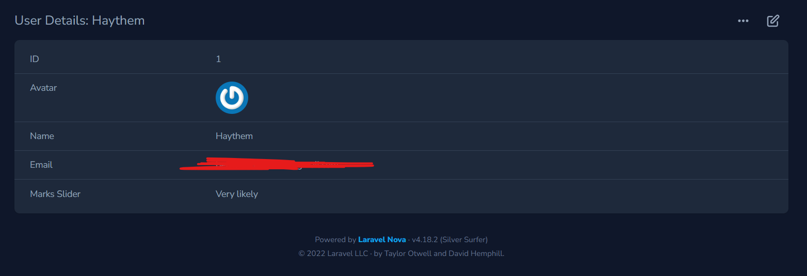
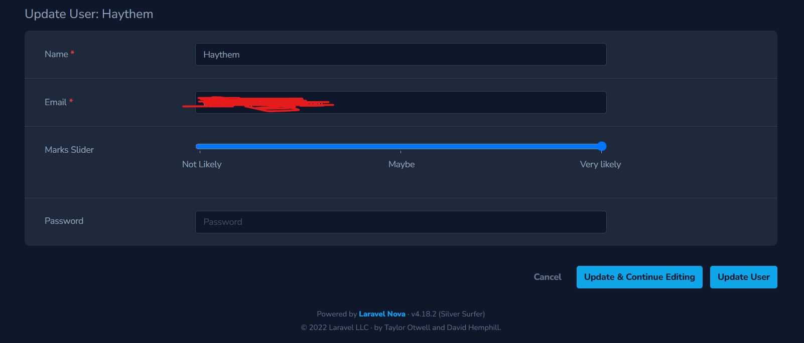
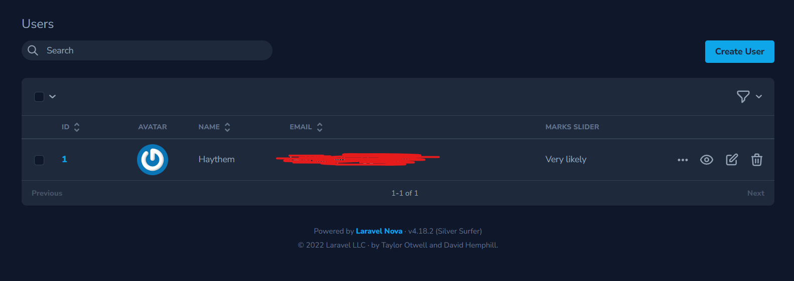

# MarksSlider

### Installation

composer require haythem/marks-slider

## Usage

```php
        // NOVA RESOURCE
        use Haythembenkhlifa\MarksSlider\MarksSlider;

        public function fields(Request $request)
        {

              return [
                        MarksSlider::make("Marks Slider", "custom_field")
                            ->setValues(['Not Likely' => 0, 'Maybe' => 2, 'Very likely' => 4])
                            ->setStep(2)
                            ->showLabels(true),
              ];
        }


```

## Screenshot






